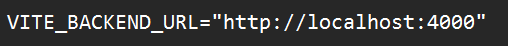
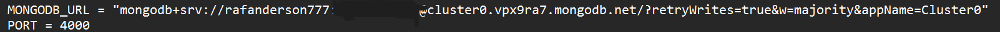

Steps:

<ul>
  <li>Clone the github repository</li>
  <li>Open Folder</li>
  <li>npm install # On root folder</li>
  <li>cd src/To-Do-List-Week8/backend</li>
  <li>npm install # On backend folder</li>
  <li>Add a .env file on the root folder containing: VITE_BACKEND_URL="http://localhost:4000" (The port is changed to which port your backend is running at) [Root Folder]</li>
  <li>Add another .env file at the backend folder containing:</li>
  <li>|| MONGODB_URL = "" (Change to your own mongodb link) [Backend Folder]</li>
  <li>|| PORT = 4000 (Change to any port you want to run the backend at) [Backend Folder]</li>
  <li>Run "npm run dev" on the root folder and "npm run server" on the backend folder</li>
</ul>

.env (Root folder) sample:

.env (Backend folder) sample:

